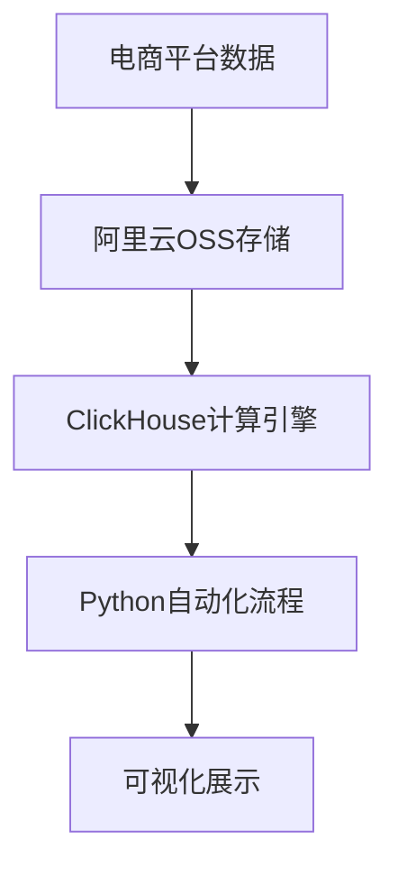

# 高频价格指数计算系统设计文档

## 一、需求分析

### 1.1 项目背景
- 传统CPI依赖人工调研与月度统计更新，存在时效性差、颗粒度粗、覆盖不全等固有缺陷
- 电商平台数据具有更新快、覆盖面广、精度高等优势，可构建高频(按日)价格指数
- 目标：突破传统CPI限制，形成更灵敏的市场监测手段

### 1.2 项目目标
1. 构建基于电商数据的高频价格指数计算系统
2. 使用阿里云OSS进行数据管理
3. 利用ClickHouse实现高效查询与价格指数构建
4. 用Python自动化计算流程
5. 通过Quick BI或Matplotlib实现价格指数趋势可视化

## 二、表结构设计

### 2.1 prices表(价格记录表)
**设计说明**  
记录电商商品的历史价格快照信息，是价格指数计算的主数据源，支持日级别高频统计分析。

| 字段名 | 类型 | 含义 |
|--------|------|------|
| product_id | UInt64 | 商品ID,对应products表主键 |
| category_id | UInt64 | 商品类别ID |
| name | String | 商品名称 |
| price | Float32 | 商品价格 |
| date | Date | 价格采集日期 |

**实现代码**  
```sql
CREATE TABLE default.prices (
    product_id UInt64,
    category_id UInt64,
    name String,
    price Float32,
    date Date
) ENGINE = MergeTree()
ORDER BY (date, product_id);
```

## 二、表结构设计（续）

### 2.2 products表(商品信息表)
**设计说明**  
提供商品的基础信息和统计属性，weight字段支持基于商品重要度的价格指数加权。

| 字段名 | 类型 | 含义 |
|--------|------|------|
| product_id | UInt64 | 商品唯一ID(主键) |
| name | String | 商品名称 |
| category_id | UInt64 | 所属类别ID |
| weight | Float32 | 商品权重(用于加权计算) |

**实现代码**  
```sql
CREATE TABLE default.products (
    product_id UInt64,
    name String,
    category_id UInt64,
    weight Float32
) ENGINE = MergeTree()
ORDER BY product_id;
```
## 2.3 categories表(商品分类表)
**设计说明**  
描述商品分类结构，支持多层级嵌套分类，weight字段可作为类级别的加权因子。

| 字段名 | 类型 | 含义 |
|--------|------|------|
| category | String | 类别名称 |
| category_id | UInt64 | 类别唯一编号(主键) |
| hierarchy | UInt8 | 类别所在层级(1=一级分类) |
| weight | Float32 | 类别权重(用于CPI加权) |
| price | Float32 | 当前类别平均价格(可选) |
| parent | Int64 | 父类别ID(一级分类为-1) |

**实现代码**  
```sql
CREATE TABLE default.categories (
    category String,
    category_id UInt64,
    hierarchy UInt8,
    weight Float32,
    price Float32,
    parent Int64
) ENGINE = OSS(
    'https://price-index-demo.oss-cn-hangzhou-internal.aliyuncs.com/categories.csv',
    'AccessKey',
    'AccessKeySecret',
    'CSVWithNames'
);
```
## 三、系统架构设计

### 3.1 总体架构设计

### 3.2 核心Python代码逻辑

#### 3.2.1 数据预处理
**数据清洗**  
1. 读取原始产品与类别数据  
2. 遍历daily_price文件夹下所有CSV文件  
3. 清洗价格数据(空值/负值等)  
4. 标准化字段与时间格式  
5. 合并文件保存为统一格式price.csv  
6. 处理categories.csv填补null值为-1  

**编码转换**  
```python
# 将GBK编码转换为UTF-8-sig
for file in ['price.csv', 'products.csv', 'categories.csv']:
    with open(file, 'r', encoding='gbk') as f_in:
        content = f_in.read()
    with open(file, 'w', encoding='utf-8-sig') as f_out:
        f_out.write(content)
```
### 3.2.1 上传文件
1. 处理后的文件上传至阿里云OSS  
2. 设置ClickHouse与OSS映射关系  

#### 3.2.2 程序初始化
```python
import configparser
from clickhouse_driver import Client
from sqlalchemy import create_engine

# 读取配置文件
config = configparser.ConfigParser()
config.read('config.ini')

# 连接ClickHouse
ch_client = Client(
    host=config['clickhouse']['host'],
    port=config['clickhouse']['port'],
    user=config['clickhouse']['user'],
    password=config['clickhouse']['password']
)

# 初始化SQLAlchemy引擎
engine = create_engine(
    f"clickhouse://{config['clickhouse']['user']}:{config['clickhouse']['password']}"
    f"@{config['clickhouse']['host']}:{config['clickhouse']['port']}/default"
)
```
### 3.2.3 计算特定日期CPI
```python
def calculate_cpi(start_date, end_date):
    """
    计算两个特定日期之间的CPI指数
    :param start_date: 基准日期 (格式: 'YYYY-MM-DD')
    :param end_date: 报告日期 (格式: 'YYYY-MM-DD')
    :return: CPI指数值
    """
    # 完整的CPI计算SQL查询
    query = f"""
    WITH leaf_categories AS (
        SELECT category_id, weight 
        FROM categories 
        WHERE parent != -1 
        AND category_id NOT IN (SELECT parent FROM categories)
    ),
    product_prices AS (
        SELECT 
            product_id,
            category_id,
            MAXIf(price, date = '{start_date}') AS base_price,
            MAXIf(price, date = '{end_date}') AS report_price
        FROM prices
        GROUP BY product_id, category_id
    ),
    category_cpi AS (
        SELECT
            category_id,
            EXP(AVG(LOG(report_price / NULLIF(base_price, 0)))) AS price_index
        FROM product_prices
        WHERE base_price > 0 AND report_price > 0
        GROUP BY category_id
    )
    SELECT
        SUM(cc.price_index * lc.weight) AS CPI
    FROM category_cpi cc
    JOIN leaf_categories lc ON cc.category_id = lc.category_id
    """
    
    result = ch_client.execute(query)
    return result[0][0]  # 返回CPI值
```
### 3.2.4 计算每日CPI序列
```python
import pandas as pd
import numpy as np

def generate_daily_cpi_series(start_date, end_date):
    """
    生成指定日期范围内的每日CPI序列
    :param start_date: 开始日期 (格式: 'YYYY-MM-DD')
    :param end_date: 结束日期 (格式: 'YYYY-MM-DD')
    :return: 包含每日CPI值的pd.Series
    """
    # 加载日期范围内所有价格数据
    price_df = pd.read_sql(f"""
        SELECT * 
        FROM prices 
        WHERE date BETWEEN '{start_date}' AND '{end_date}'
    """, engine)
    
    # 获取类别权重
    category_weights = pd.read_sql("""
        SELECT category_id, weight 
        FROM categories
    """, engine).set_index('category_id')['weight']
    
    # 创建价格透视表
    pivot_df = price_df.pivot_table(
        index='product_id',
        columns='date',
        values='price',
        aggfunc='max'
    )
    
    # 添加类别ID映射
    product_categories = price_df[['product_id', 'category_id']].drop_duplicates().set_index('product_id')
    pivot_df = pivot_df.join(product_categories)
    
    # 计算每日CPI
    cpi_series = {}
    base_prices = pivot_df[start_date]
    for date in pivot_df.columns:
        if date == start_date:
            cpi_series[date] = 100  # 基期CPI=100
            continue
        if date == 'category_id':  # 跳过类别列
            continue
            
        # 计算每日价格指数
        current_prices = pivot_df[date]
        valid_products = base_prices.notnull() & current_prices.notnull() & (base_prices > 0) & (current_prices > 0)
        daily_ratios = np.log(current_prices[valid_products] / base极ces[valid_products])
        
        # 按类别分组计算指数
        category_indices = daily_ratios.groupby(pivot_df.loc[valid_products, 'category_id']).mean().apply(np.exp)
        
        # 加权聚合
        valid_categories = category_indices.index.intersection(category_weights.index)
        weighted_cpi = (category_indices[valid_categories] * category_weights[valid_categories]).sum()
        cpi_series[date] = weighted_cpi
    
    return pd.Series(cpi_series)
```
### 3.3 核心SQL代码逻辑

#### 3.3.1 找出叶子类别
```sql
WITH leaf_categories AS (
    SELECT category_id, weight 
    FROM categories 
    WHERE parent != -1 
    AND category_id NOT IN (SELECT parent FROM categories)
)
```
### 3.3.2 汇总产品价格
```sql
product_prices AS (
    SELECT 
        product_id,
        category_id,
        MAXIf(price, date = '2023-01-01') AS base_price,  -- 基准日
        MAXIf(price, date = '2023-06-01') AS report_price -- 报告日
    FROM prices
    GROUP BY product_id, category_id
)
```
### 3.3.3 计算类别价格指数
```sql
category_cpi AS (
    SELECT
        category_id,
        EXP(AVG(LOG(report_price / NULLIF(base_price, 0)))) AS price_index
    FROM product_prices
    WHERE base_price > 0 AND report_price > 0  -- 过滤有效价格
    GROUP BY category_id
)
```
### 3.3.4 聚合加权CPI
```sql
SELECT
    SUM(cc.price_index * lc.weight) AS CPI
FROM category_cpi cc
JOIN leaf_categories lc ON cc.category_id = lc.category_id
```
## 四、测试与验证设计

### 测试目的
确保数据清洗脚本的正确性、鲁棒性与兼容性，为高频价格指数计算提供可靠数据基础。

### 测试内容与方法

#### 1) 单元测试
| 测试模块 | 测试点 | 验证方法 |
|---------|-------|---------|
| 字段提取 | 字段解析准确性 | 构造含特殊字符的商品名称测试 |
| 日期解析 | 多格式转换能力 | 使用不同日期格式(yyyy/MM/dd, dd-MM-yyyy等)测试 |
| 价格过滤 | 异常数据处理 | 输入负值/NaN/--等异常价格验证过滤效果 |
| 输出验证 | 文件规范 | 检查编码/字段顺序/数据完整性 |
| 系统兼容 | 跨平台运行 | 在Windows/Linux系统分别执行脚本 |

#### 2) 集成测试
| 测试类型 | 验证指标 | 通过标准 |
|---------|---------|---------|
| 商品覆盖率 | 清洗后商品种类数/原始商品总数 | ≥98% |
| 异常识别率 | 正确剔除异常数据量/预标注异常总量 | ≥99% |
| 数据一致性 | ClickHouse字段类型匹配度 | 100%匹配 |
| 计算准确性 | CPI计算结果误差 | ≤0.5% |
